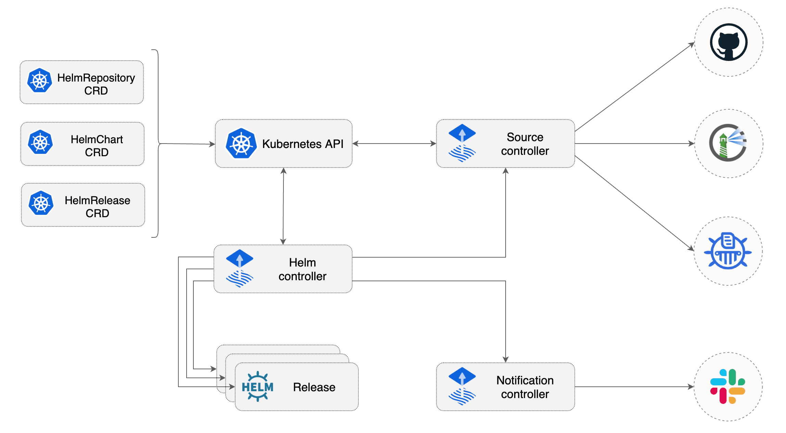

# Helm Controller

The Helm Controller is a Kubernetes operator, allowing one to declaratively manage Helm chart
releases with Kubernetes manifests.

The desired state of a Helm release is described through a Kubernetes Custom Resource named `HelmRelease`.
Based on the creation, mutation or removal of a `HelmRelease` resource in the cluster,
Helm actions are performed by the controller.

Features:

- Watches for `HelmRelease` objects and generates `HelmChart` objects
- Supports `HelmChart` artifacts produced from `HelmRepository` and `GitRepository` sources
- Fetches artifacts produced by [source-controller](../source/controller.md) from `HelmChart` objects
- Watches `HelmChart` objects for revision changes (including semver ranges for charts from `HelmRepository` sources)
- Performs automated Helm actions, including Helm tests, rollbacks and uninstalls
- Offers extensive configuration options for automated remediation (rollback, uninstall, retry) on failed Helm install, upgrade or test actions
- Runs Helm install/upgrade in a specific order, taking into account the depends-on relationship defined in a set of `HelmRelease` objects
- Prunes Helm releases removed from cluster (garbage collection) 
- Reports Helm releases statuses (alerting provided by [notification-controller](../notification/controller.md))
- Built-in Kustomize compatible Helm post renderer, providing support for strategic merge, JSON 6902 and images patches

Links:

- Source code [fluxcd/helm-controller](https://github.com/fluxcd/helm-controller)
- Specification [docs](https://github.com/fluxcd/helm-controller/tree/main/docs/spec)
