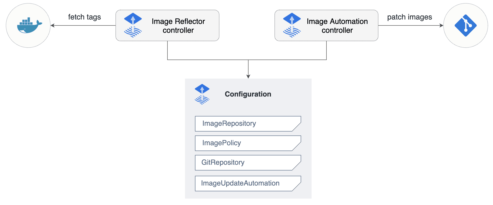

# Image reflector and automation controllers

The image-reflector-controller and image-automation-controller work together to update a Git
repository when new container images are available.

- The image-reflector-controller scans image repositories and reflects the image metadata in
  Kubernetes resources.
- The image-automation-controller updates YAML files based on the latest images scanned, and commits
  the changes to a given Git repository.

Links:

- Source code [fluxcd/image-reflector-controller](https://github.com/fluxcd/image-reflector-controller)
- Reflector [specification docs](https://github.com/fluxcd/image-reflector-controller/tree/main/docs/spec)
- Source code [fluxcd/image-automation-controller](https://github.com/fluxcd/image-automation-controller)
- Automation [specification docs](https://github.com/fluxcd/image-automation-controller/tree/main/docs/spec)
