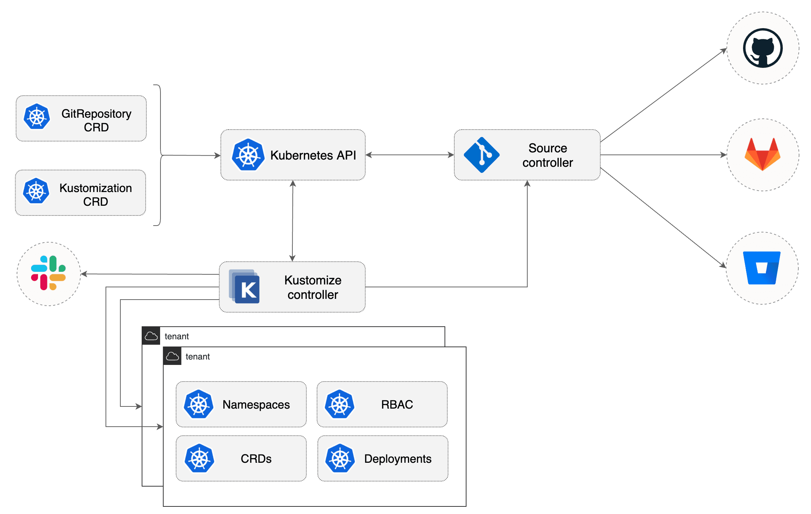

# Kustomize Controller

The kustomize-controller is a Kubernetes operator,
specialized in running continuous delivery pipelines for infrastructure and
workloads defined with Kubernetes manifests and assembled with Kustomize.

Features:

- Reconciles the cluster state from multiple sources (provided by source-controller)
- Generates manifests with Kustomize (from plain Kubernetes yamls or Kustomize overlays)
- Validates manifests against Kubernetes API
- Impersonates service accounts (multi-tenancy RBAC)  
- Health assessment of the deployed workloads
- Runs pipelines in a specific order (depends-on relationship)
- Prunes objects removed from source (garbage collection) 
- Reports cluster state changes (alerting provided by notification-controller)

Links:

- Source code [fluxcd/kustomize-controller](https://github.com/fluxcd/kustomize-controller)
- Specification [docs](https://github.com/fluxcd/kustomize-controller/tree/master/docs/spec)
