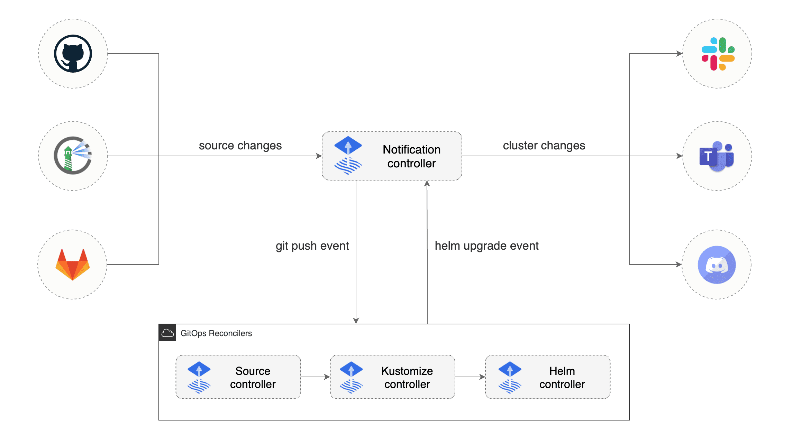

# Notification Controller

The Notification Controller is a Kubernetes operator, specialized in handling inbound and outbound events.

The controller handles events coming from external systems (GitHub, GitLab, Bitbucket, Harbor, Jenkins, etc)
and notifies the GitOps toolkit controllers about source changes.

The controller handles events emitted by the GitOps toolkit controllers (source, kustomize, helm)
and dispatches them to external systems (Slack, Microsoft Teams, Discord, Rocker)
based on event severity and involved objects.

Links:

- Source code [fluxcd/notification-controller](https://github.com/fluxcd/notification-controller)
- Specification [docs](https://github.com/fluxcd/notification-controller/tree/main/docs/spec)
