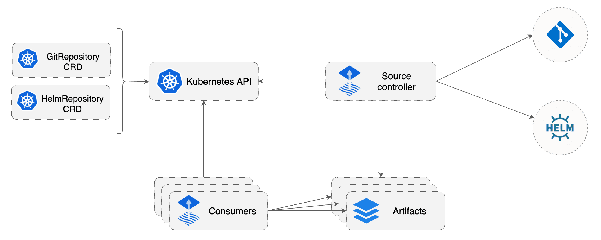

# Source Controller

The main role of the source management component is to provide a common interface for artifacts acquisition.
The source API defines a set of Kubernetes objects that cluster admins and various automated operators can
interact with to offload the Git and Helm repositories operations to a dedicated controller.

Features:

- Validate source definitions
- Authenticate to sources (SSH, user/password, API token)
- Validate source authenticity (PGP)
- Detect source changes based on update policies (semver)
- Fetch resources on-demand and on-a-schedule
- Package the fetched resources into a well-known format (tar.gz, yaml)
- Make the artifacts addressable by their source identifier (sha, version, ts)
- Make the artifacts available in-cluster to interested 3rd parties
- Notify interested 3rd parties of source changes and availability (status conditions, events, hooks)

Links:

- Source code [fluxcd/source-controller](https://github.com/fluxcd/source-controller)
- Specification [docs](https://github.com/fluxcd/source-controller/tree/master/docs/spec)