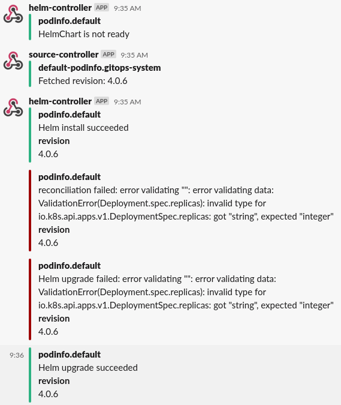

# Manage Helm Releases

The [helm-controller](../components/helm/controller.md) allows you to
declaratively manage Helm chart releases with Kubernetes manifests.
It makes use of the artifacts produced by the
[source-controller](../components/source/controller.md) from
`HelmRepository`, `GitRepository`, `Bucket` and `HelmChart` resources.
The helm-controller is part of the default toolkit installation.

## Prerequisites

To follow this guide you'll need a Kubernetes cluster with the GitOps 
toolkit controllers installed on it.
Please see the [get started guide](../get-started/index.md)
or the [installation guide](installation.md).

## Define a chart source

To be able to release a Helm chart, the source that contains the chart
(either a `HelmRepository`, `GitRepository`, or `Bucket`) has to be known
first to the source-controller, so that the `HelmRelease` can reference
to it.

A cluster administrator should register trusted sources by creating
the resources in the `flux-system` namespace. By default, the
source-controller watches for sources only in the `flux-system`
namespace, this way cluster admins can prevent untrusted sources from
being registered by users.

### Helm repository

Helm repositories are the recommended source to retrieve Helm charts
from, as they are lightweight in processing and make it possible to
configure a semantic version selector for the chart version that should
be released.

They can be declared by creating a `HelmRepository` resource, the
source-controller will fetch the Helm repository index for this
resource on an interval and expose it as an artifact:

```yaml
apiVersion: source.toolkit.fluxcd.io/v1beta1
kind: HelmRepository
metadata:
  name: podinfo
  namespace: flux-system
spec:
  interval: 1m
  url: https://stefanprodan.github.io/podinfo
```

The `interval` defines at which interval the Helm repository index
is fetched, and should be at least `1m`. Setting this to a higher
value means newer chart versions will be detected at a slower pace,
a push-based fetch can be introduced using [webhook receivers](webhook-receivers.md)

The `url` can be any HTTP/S Helm repository URL.

!!! hint "Authentication"
    HTTP/S basic and TLS authentication can be configured for private
    Helm repositories. See the [`HelmRepository` CRD docs](../components/source/helmrepositories.md)
    for more details.
    
### Git repository

Charts from Git repositories can be released by declaring a
`GitRepository`, the source-controller will fetch the contents of the
repository on an interval and expose it as an artifact.

The source-controller can build and expose Helm charts as artifacts
from the contents of the `GitRepository` artifact (more about this
later on in the guide).

**There is one caveat you should be aware of:** to make the
source-controller produce a new chart artifact, the `version` in the
`Chart.yaml` of the chart must be bumped.
  
An example `GitRepository`:

```yaml
apiVersion: source.toolkit.fluxcd.io/v1beta1
kind: GitRepository
metadata:
  name: podinfo
  namespace: flux-system
spec:
  interval: 1m
  url: https://github.com/stefanprodan/podinfo
  ref:
    branch: master
  ignore: |
    # exclude all
    /*
    # include charts directory
    !/charts/
```

The `interval` defines at which interval the Git repository contents
are fetched, and should be at least `1m`. Setting this to a higher
value means newer chart versions will be detected at a slower pace,
a push-based fetch can be introduced using [webhook receivers](webhook-receivers.md)

The `url` can be any HTTP/S or SSH address (the latter requiring
authentication).

The `ref` defines the checkout strategy, and is set to follow the
`master` branch in the above example. For other strategies like
tags or commits, see the [`GitRepository` CRD docs](../components/source/gitrepositories.md).

The `ignore` defines file and folder exclusion for the
artifact produced, and follows the [`.gitignore` pattern
format](https://git-scm.com/docs/gitignore#_pattern_format).
The above example only includes the `charts` directory of the
repository and omits all other files.

!!! hint "Authentication"
    HTTP/S basic and SSH authentication can be configured for private
    Git repositories. See the [`GitRepository` CRD docs](../components/source/gitrepositories.md)
    for more details.
    
### Bucket

Charts from S3 compatible storage buckets can be released by declaring
a `Bucket`, the source-controller will fetch the contents of the bucket
on an interval and expose it as an artifact.

**There is one caveat you should be aware of:** to make the
source-controller produce a new chart artifact, the `version` in the
`Chart.yaml` of the chart must be bumped.

An example `Bucket`:

```yaml
apiVersion: source.toolkit.fluxcd.io/v1beta1
kind: Bucket
metadata:
  name: podinfo
  namespace: gotk-system
spec:
  interval: 1m
  provider: generic
  bucketName: podinfo
  endpoint: minio.minio.svc.cluster.local:9000
  ignore: |
    # exclude all
    /*
    # include charts directory
    !/charts/
```

The `interval` defines at which interval the Git repository contents
are fetched, and should be at least `1m`. Setting this to a higher
value means newer chart versions will be detected at a slower pace,
a push-based fetch can be introduced using [webhook receivers](webhook-receivers.md)

The `provider`, `bucketName` and `endpoint` together define what
S3 compatible storage should be connected to. For more information,
see the [`Bucket` CRD docs](../components/source/buckets.md).


The `ignore` defines file and folder exclusion for the
artifact produced, and follows the [`.gitignore` pattern
format](https://git-scm.com/docs/gitignore#_pattern_format).
The above example only includes the `charts` directory of the
repository and omits all other files.

## Define a Helm release

With the chart source created, define a new `HelmRelease` to release
the Helm chart:

```yaml
apiVersion: helm.toolkit.fluxcd.io/v2beta1
kind: HelmRelease
metadata:
  name: podinfo
  namespace: default
spec:
  interval: 5m
  chart:
    spec:
      chart: <name|path>
      version: '4.0.x'
      sourceRef:
        kind: <HelmRepository|GitRepository|Bucket>
        name: podinfo
        namespace: flux-system
      interval: 1m
  values:
    replicaCount: 2
```

The `chart.spec` values are used by the helm-controller as a template
to create a new `HelmChart` resource in the same namespace as the
`sourceRef`. The source-controller will then lookup the chart in the
artifact of the referenced source, and either fetch the chart for a
`HelmRepository`, or build it from a `GitRepository` or `Bucket`.
It will then make it available as a `HelmChart` artifact to be used by
the helm-controller.

The `chart.spec.chart` can either contain:

* The name of the chart as made available by the `HelmRepository`
  (without any aliases), for example: `podinfo`
* The relative path the chart can be found at in the `GitRepository`
  or `Bucket`, for example: `./charts/podinfo`
* The relative path the chart package can be found at in the
  `GitRepository` or `Bucket`, for example: `./charts/podinfo-1.2.3.tgz`

The `chart.spec.version` can be a fixed semver, or any semver range
(i.e. `>=4.0.0 <5.0.0`). It is only taken into account for `HelmRelease`
resources that reference a `HelmRepository` source.

!!! hint "Advanced configuration"
    The `HelmRelease` offers an extensive set of configurable flags
    for finer grain control over how Helm actions are performed.
    See the [`HelmRelease` CRD docs](../components/helm/helmreleases.md)
    for more details.

## Refer to values in `ConfigMap` and `Secret` resources

It is possible to define a list of `ConfigMap` and `Secret` resources
from which to take values. The values are merged in the order given,
with the later values overwriting earlier. These values always have a
lower priority than the values inlined in the `HelmRelease` via the
`spec.values` parameter.

```yaml
spec:
  valuesFrom:
  - kind: ConfigMap
    name: prod-env-values
    valuesKey: values-prod.yaml
  - kind: Secret
    name: prod-tls-values
    valuesKey: crt
    targetPath: tls.crt
```

The definition of the listed keys is as follows:

- `kind`: Kind of the values referent (`ConfigMap` or `Secret`).
- `name`: Name of the values referent, in the same namespace as the
  `HelmRelease`.
- `valuesKey` _(Optional)_: The data key where the values.yaml or a
   specific value can be found. Defaults to `values.yaml` when omitted.
- `targetPath` _(Optional)_: The YAML dot notation path at which the
   value should be merged. When set, the `valuesKey` is expected to be
   a single flat value. Defaults to `None` when omitted, which results
   in the values getting merged at the root.

!!! hint "Note"
    The `targetPath` supports the same formatting as you would supply
    as an argument to the `helm` binary using `--set [path]=[value]`.
    In addition to this, the referred value can contain the same
    value formats (e.g. `{a,b,c}` for a list).
    You can read more about the available formats and limitations in
    the [Helm documentation](https://helm.sh/docs/intro/using_helm/#the-format-and-limitations-of---set).

## Refer to values in `ConfigMaps` generated with Kustomize

It is possible to use Kustomize [ConfigMap generator](https://kubectl.docs.kubernetes.io/references/kustomize/configmapgenerator/)
to trigger a Helm release upgrade every time the encoded values change.

First create a `kustomizeconfig.yaml` for Kustomize to be able to patch
`ConfigMaps` referenced in `HelmRelease` manifests:

```yaml
nameReference:
- kind: ConfigMap
  version: v1
  fieldSpecs:
  - path: spec/valuesFrom/name
    kind: HelmRelease
```

Create a `HelmRelease` definition that references a `ConfigMap`:

```yaml
apiVersion: helm.toolkit.fluxcd.io/v2beta1
kind: HelmRelease
metadata:
  name: podinfo
  namespace: podinfo
spec:
  interval: 5m
  releaseName: podinfo
  chart:
    spec:
      chart: podinfo
      sourceRef:
        kind: HelmRepository
        name: podinfo
  valuesFrom:
    - kind: ConfigMap
      name: podinfo-values
```

Create a `kustomization.yaml` that generates the `ConfigMap` using our kustomize config:

```yaml
apiVersion: kustomize.config.k8s.io/v1beta1
kind: Kustomization
namespace: podinfo
resources:
  - namespace.yaml
  - repository.yaml
  - release.yaml
configMapGenerator:
  - name: podinfo-values
    files:
      - values.yaml=my-values.yaml
configurations:
  - kustomizeconfig.yaml
```

When [kustomize-controller](../components/kustomize/controller.md) reconciles the above manifests, it will generate
a unique name of the `ConfigMap` every time `my-values.yaml` content is updated in Git:

```yaml
apiVersion: helm.toolkit.fluxcd.io/v2beta1
kind: HelmRelease
metadata:
  name: podinfo
  namespace: podinfo
spec:
  valuesFrom:
  - kind: ConfigMap
    name: podinfo-values-2mh2t8m94h
```

!!! hint "Note"
    Stale `ConfigMaps`, previously generated by Kustomize, will be
    removed from the cluster by kustomize-controller if
    [pruning](../components/kustomize/kustomization/#garbage-collection) is enabled.

## Refer to values inside the chart

It is possible to replace the `values.yaml` with a different file present inside the Helm chart.

```yaml
apiVersion: helm.toolkit.fluxcd.io/v2beta1
kind: HelmRelease
metadata:
  name: mongodb
  namespace: mongodb
spec:
  interval: 5m
  chart:
    spec:
      chart: mongodb
      sourceRef:
        kind: HelmRepository
        name: bitnami
      valuesFile: values-production.yaml
  values:
    replicaCount: 5
```

If the `spec.chart.spec.valuesFile` doesn't exists inside the chart, helm-controller will not be able to
fetch the chart. To determine why the `HelmChart` fails to produce an artifact, you can inspect the status with:

```console
$ kubectl get helmcharts --all-namespaces
NAME    READY   STATUS
mongodb False   failed to locate override values file: values-prod.yaml
```

## Configure notifications

The default toolkit installation configures the helm-controller to
broadcast events to the [notification-controller](../components/notification/controller.md).

To receive the events as notifications, a `Provider` needs to be setup
first as described in the [notifications guide](notifications.md#define-a-provider).
Once you have set up the `Provider`, create a new `Alert` resource in
the `flux-system` to start receiving notifications about the Helm
release:

```yaml
apiVersion: notification.toolkit.fluxcd.io/v1beta1
  kind: Alert
  metadata:
    generation: 2
    name: helm-podinfo
    namespace: flux-system
  spec:
    providerRef:
      name: slack
    eventSeverity: info
    eventSources:
    - kind: HelmRepository
      name: podinfo
    - kind: HelmChart
      name: default-podinfo
    - kind: HelmRelease
      name: podinfo
      namespace: default
```



## Configure webhook receivers

When using semver ranges for Helm releases, you may want to trigger an update
as soon as a new chart version is published to your Helm repository.
In order to notify source-controller about a chart update,
you can [setup webhook receivers](webhook-receivers.md).

First generate a random string and create a secret with a `token` field:

```sh
TOKEN=$(head -c 12 /dev/urandom | shasum | cut -d ' ' -f1)
echo $TOKEN

kubectl -n flux-system create secret generic webhook-token \	
--from-literal=token=$TOKEN
```

When using [Harbor](https://goharbor.io/) as your Helm repository, you can define a receiver with:

```yaml
apiVersion: notification.toolkit.fluxcd.io/v1beta1
kind: Receiver
metadata:
  name: helm-podinfo
  namespace: flux-system
spec:
  type: harbor
  secretRef:
    name: webhook-token
  resources:
    - kind: HelmRepository
      name: podinfo
```

The notification-controller generates a unique URL using the provided token and the receiver name/namespace.

Find the URL with:

```console
$ kubectl -n flux-system get receiver/helm-podinfo

NAME           READY   STATUS
helm-podinfo   True    Receiver initialised with URL: /hook/bed6d00b5555b1603e1f59b94d7fdbca58089cb5663633fb83f2815dc626d92b
```

Log in to the Harbor interface, go to Projects, select a project, and select Webhooks.
Fill the form with:

* Endpoint URL: compose the address using the receiver LB and the generated URL `http://<LoadBalancerAddress>/<ReceiverURL>`
* Auth Header: use the `token` string

With the above settings, when you upload a chart, the following happens:

* Harbor sends the chart push event to the receiver address
* Notification controller validates the authenticity of the payload using the auth header
* Source controller is notified about the changes
* Source controller pulls the changes into the cluster and updates the `HelmChart` version
* Helm controller is notified about the version change and upgrades the release

!!! hint "Note"
    Besides Harbor, you can define receivers for **GitHub**, **GitLab**, **Bitbucket**
    and any other system that supports webhooks e.g. Jenkins, CircleCI, etc.
    See the [Receiver CRD docs](../components/notification/receiver.md) for more details.
