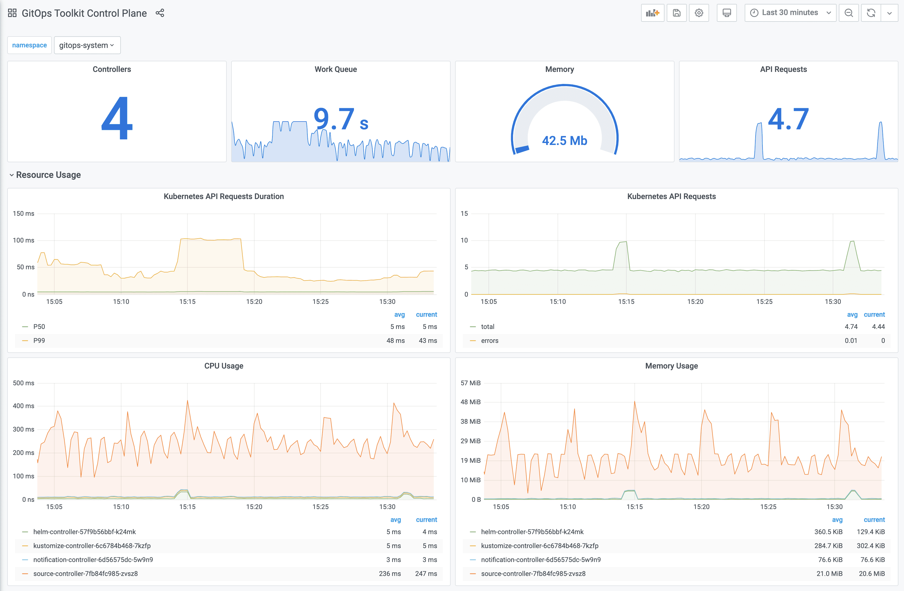
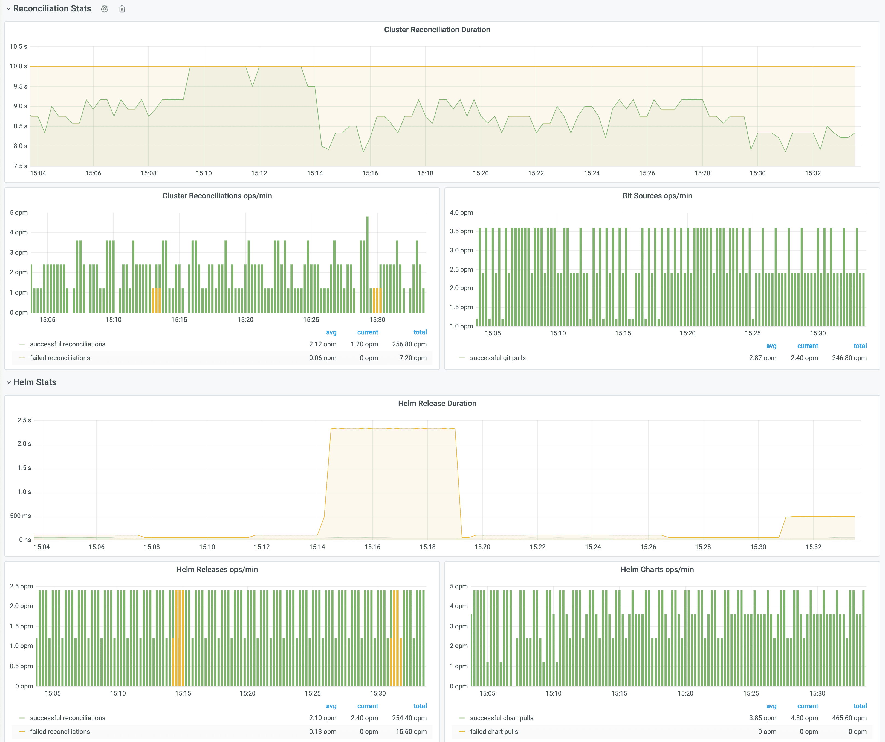

# Installation 

This guide walks you through setting up the GitOps Toolkit 
to manage one or more Kubernetes clusters.

## Prerequisites

You will need a Kubernetes cluster version **1.16** or newer
and kubectl version **1.18** or newer.

Install the toolkit CLI with:

```sh
curl -s https://toolkit.fluxcd.io/install.sh | sudo bash
```

The install script downloads the gotk binary to `/usr/local/bin`.
Binaries for macOS and Linux AMD64 are available for download on the 
[release page](https://github.com/fluxcd/toolkit/releases).

Verify that your cluster satisfies the prerequisites with:

```sh
gotk check --pre
```

## Bootstrap

Using the `gotk bootstrap` command you can install the toolkit on a Kubernetes cluster 
and configure it to manage itself from a Git repository.

The bootstrap creates a Git repository if one doesn't exist and
commits the toolkit components manifests to the master branch.
Then it configures the target cluster to synchronize with that
repository by setting up SSH deploy keys.

If the toolkit components are present on the cluster,
the bootstrap command will perform an upgrade if needed.
The bootstrap is idempotent, it's safe to run the command as many times as you want.

You can choose what components to install and for which cluster with:

```sh
gotk bootstrap <GIT-PROVIDER> \
  --components=source-controller,kustomize-controller,helm-controller,notification-controller \
  --path=my-cluster \
  --version=latest
```

If you wish to install a specific version, use the toolkit 
[release tag](https://github.com/fluxcd/toolkit/releases) e.g. `--version=v0.0.14`.

With `--path` you can configure the directory which will be used to reconcile the target cluster.
To control multiple clusters from the same Git repository, you have to set a unique path per
cluster e.g. `staging-cluster` and `production-cluster`:

```sh
├── staging-cluster # <- path=staging-cluster
│   └── gitops-system # <- namespace dir generated by bootstrap
│       ├── toolkit-components.yaml
│       ├── toolkit-kustomization.yaml
│       └── toolkit-source.yaml
└── production-cluster # <- path=production-cluster
    └── gitops-system
``` 

### GitHub and GitHub Enterprise

Generate a [personal access token](https://help.github.com/en/github/authenticating-to-github/creating-a-personal-access-token-for-the-command-line)
that can create repositories by checking all permissions under `repo`.

Export your GitHub personal access token as an environment variable:

```sh
export GITHUB_TOKEN=<your-token>
```

Run the bootstrap for a repository on your personal GitHub account:

```sh
gotk bootstrap github \
  --owner=my-github-username \
  --repository=my-repository \
  --path=my-cluster \
  --personal
```

Run the bootstrap for a repository owned by a GitHub organization:

```sh
gotk bootstrap github \
  --owner=my-github-organization \
  --repository=my-repository \
  --team=team1-slug \
  --team=team2-slug \
  --path=my-cluster
```

When you specify a list of teams, those teams will be granted maintainer access to the repository.

To run the bootstrap for a repository hosted on GitHub Enterprise, you have to specify your GitHub hostname:

```sh
gotk bootstrap github \
  --hostname=my-github-enterprise.com \
  --owner=my-github-organization \
  --repository=my-repository \
  --path=my-cluster
```

### GitLab and GitLab Enterprise

Generate a [personal access token](https://docs.gitlab.com/ee/user/profile/personal_access_tokens.html)
that grants complete read/write access to the GitLab API.

Export your GitLab personal access token as an environment variable:

```sh
export GITLAB_TOKEN=<your-token>
```

Run the bootstrap for a repository on your personal GitLab account:

```sh
gotk bootstrap gitlab \
  --owner=my-gitlab-username \
  --repository=my-repository \
  --path=my-cluster \
  --personal
```

Run the bootstrap for a repository owned by a GitLab group:

```sh
gotk bootstrap gitlab \
  --owner=my-gitlab-group \
  --repository=my-repository \
  --path=my-cluster
```

To run the bootstrap for a repository hosted on GitLab on-prem or enterprise, you have to specify your GitLab hostname:

```sh
gotk bootstrap gitlab \
  --hostname=my-gitlab.com \
  --owner=my-gitlab-group \
  --repository=my-repository \
  --path=my-cluster
```

### Generic Git Server

For other Git providers such as Bitbucket, Gogs, Gitea, etc you can manually setup the repository and the deploy key.

Create a Git repository and clone it locally:

```sh
git clone ssh://<host>/<org>/my-repository
cd my-repository
```

Create a directory inside the repository:

```sh
mkdir -p ./my-cluster/gitops-system
```

Generate the toolkit manifests with:

```sh
gotk install --version=latest \
  --export > ./my-cluster/gitops-system/toolkit-components.yaml
```

If your cluster must pull images from a private container registry, first you should pull
the toolkit images from Docker Hub and push them to your registry, for example:

```sh
docker pull fluxcd/source-controller:v0.0.7
docker tag fluxcd/source-controller:v0.0.7 registry.internal/fluxcd/source-controller:v0.0.7
docker push registry.internal/fluxcd/source-controller:v0.0.7
```

Create the pull secret in the `gitops-system` namespace:

```sh
kubectl create ns gitops-system

kubectl -n gitops-system create secret generic regcred \
    --from-file=.dockerconfigjson=/.docker/config.json \
    --type=kubernetes.io/dockerconfigjson
```

Set your registry domain, and the pull secret when generating the manifests:

```sh
gotk install --version=latest \
  --registry=registry.internal/fluxcd \
  --image-pull-secret=regcred \
  --export > ./my-cluster/gitops-system/toolkit-components.yaml
```

Commit and push the manifest to the master branch:

```sh
git add -A && git commit -m "add toolkit manifests" && git push
```

Apply the manifests on your cluster:

```sh
kubectl apply -f ./my-cluster/gitops-system/toolkit-components.yaml
```

Verify that the toolkit controllers have started:

```sh
gotk check
```

Create a `GitRepository` object on your cluster by specifying the SSH address of your repo:

```sh
gotk create source git gitops-system \
  --url= ssh://<host>/<org>/my-repository \
  --ssh-key-algorithm=ecdsa \
  --ssh-ecdsa-curve=p521 \
  --branch=master \
  --interval=1m
```

You will be prompted to add a deploy key to your repository.
If you don't specify the SSH algorithm, then gotk will generate an RSA 2048 bits key.

If your Git server supports basic auth, you can set the URL to HTTPS and specify the credentials with:

```sh
gotk create source git gitops-system \
  --url=https://<host>/<org>/my-repository \
  --username=my-username \
  --password=my-password \
  --branch=master \
  --interval=1m
```

Create a `Kustomization` object on your cluster:

```sh
gotk create kustomization gitops-system \
  --source=gitops-system \
  --path="./my-cluster" \
  --prune=true \
  --interval=10m
```

Export both objects, commit and push the manifests to Git:

```sh
gotk export source git gitops-system \
  > ./my-cluster/gitops-system/toolkit-source.yaml

gotk export kustomization gitops-system \
  > ./my-cluster/gitops-system/toolkit-kustomization.yaml

git add -A && git commit -m "add toolkit reconciliation" && git push
```

To upgrade the toolkit to a newer version, run the install command and commit the changes:

```sh
gotk install --version=latest \
  --export > ./my-cluster/gitops-system/toolkit-components.yaml

git add -A && git commit -m "update toolkit" && git push
```

The source-controller will pull the changes on the cluster, then the kustomize-controller
will perform a rolling update of all toolkit components including itself.

## Dev install

For testing purposes you can install the toolkit without storing its manifests in a Git repository.

Here is the equivalent to `fluxctl install`:

```sh
gotk install \
  --components=source-controller,kustomize-controller
```

Then you can register Git repositories and reconcile them on your cluster:

```sh
gotk create source git podinfo \
  --url=https://github.com/stefanprodan/podinfo \
  --tag-semver=">=4.0.0" \
  --interval=1m

gotk create kustomization podinfo-default \
  --source=podinfo \
  --path="./kustomize" \
  --prune=true \
  --validation=client \
  --interval=10m \
  --health-check="Deployment/podinfo.default" \
  --health-check-timeout=2m
```

Here is the equivalent to `helm install helm-operator`:

```sh
gotk install \
  --components=source-controller,kustomize-controller,helm-controller
```

Then you can register Helm repositories and create Helm releases:

```sh
gotk create source helm stable \
--interval=1h \
--url=https://kubernetes-charts.storage.googleapis.com

gotk create helmrelease sealed-secrets \
--interval=1h \
--release-name=sealed-secrets \
--target-namespace=gitops-system \
--source=HelmRepository/stable \
--chart=sealed-secrets \
--chart-version="1.10.x"
```

### Monitoring with Prometheus and Grafana

The GitOps Toolkit comes with an optional monitoring stack.
You can install the stack in the `gitops-system` namespace with:

```yaml
kustomize build github.com/fluxcd/toolkit/manifests/monitoring?ref=master | kubectl apply -f-
```

The monitoring stack is composed of:

* Prometheus server - collects metrics from the toolkit controllers and stores them for 2h
* Grafana dashboards - displays the control plane resource usage and reconciliation stats





If you wish to use your own Prometheus and Grafana instances, then you can import the dashboards from
[GitHub](https://github.com/fluxcd/toolkit/tree/master/manifests/monitoring/grafana/dashboards).

!!! hint
    Note that the toolkit controllers expose the `/metrics` endpoint on port `8080`.
    When using Prometheus Operator you should create `PodMonitor` objects to configure scraping.
    When Prometheus is running outside of the `gitops-system` namespace, you have to create a network policy
    that allows traffic on port `8080` from the namespace where Prometheus is deployed.
