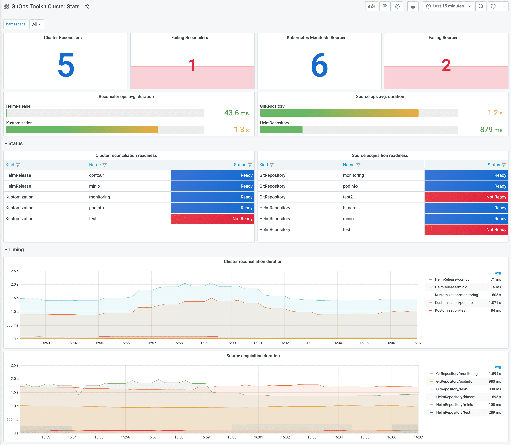

# Monitoring 

This guide walks you through configuring monitoring for the GitOps Toolkit control plane.

The toolkit comes with a monitoring stack composed of:

* **Prometheus** server - collects metrics from the toolkit controllers and stores them for 2h
* **Grafana** dashboards - displays the control plane resource usage and reconciliation stats

## Install the monitoring stack

To install the monitoring stack with `gotk`, first register the toolkit Git repository on your cluster:

```sh
gotk create source git monitoring \
  --interval=30m \
  --url=https://github.com/fluxcd/toolkit \
  --branch=main
```

Then apply the [manifests/monitoring](https://github.com/fluxcd/toolkit/tree/main/manifests/monitoring)
kustomization:

```sh
gotk create kustomization monitoring \
  --interval=1h \
  --prune=true \
  --source=monitoring \
  --path="./manifests/monitoring" \
  --health-check="Deployment/prometheus.gotk-system" \
  --health-check="Deployment/grafana.gotk-system"
```

You can access Grafana using port forwarding:

```sh
kubectl -n gotk-system port-forward svc/grafana 3000:3000
```

## Grafana dashboards

Control plane dashboard [http://localhost:3000/d/gitops-toolkit-control-plane](http://localhost:3000/d/gitops-toolkit-control-plane/gitops-toolkit-control-plane):


Cluster reconciliation dashboard [http://localhost:3000/d/gitops-toolkit-cluster](http://localhost:3000/d/gitops-toolkit-cluster/gitops-toolkit-cluster-stats):



If you wish to use your own Prometheus and Grafana instances, then you can import the dashboards from
[GitHub](https://github.com/fluxcd/toolkit/tree/main/manifests/monitoring/grafana/dashboards).

!!! hint
    Note that the toolkit controllers expose the `/metrics` endpoint on port `8080`.
    When using Prometheus Operator you should create `PodMonitor` objects to configure scraping.

## Metrics

For each `toolkit.fluxcd.io` kind,
the controllers expose a gauge metric to track the Ready condition status,
and a histogram with the reconciliation duration in seconds.

Ready status metrics:

```sh
gotk_reconcile_condition{kind, name, namespace, type="Ready", status="True"}
gotk_reconcile_condition{kind, name, namespace, type="Ready", status="False"}
gotk_reconcile_condition{kind, name, namespace, type="Ready", status="Unkown"}
gotk_reconcile_condition{kind, name, namespace, type="Ready", status="Deleted"}
```

Time spent reconciling:

```
gotk_reconcile_duration_bucket{kind, name, namespace, le}
gotk_reconcile_duration_sum{kind, name, namespace}
gotk_reconcile_duration_count{kind, name, namespace}
```

Alert manager example:

```yaml
groups:
- name: GitOpsToolkit
  rules:
  - alert: ReconciliationFailure
    expr: gotk_reconcile_condition{type="Ready",status="False"} == 1
    for: 10m
    labels:
      severity: page
    annotations:
      summary: '{{ $labels.kind }} {{ $labels.namespace }}/{{ $labels.name }} reconciliation has been failing for more than ten minutes.'
```
