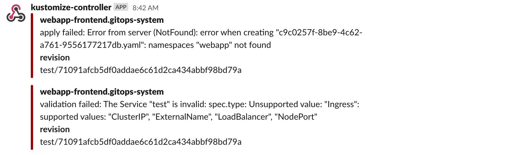

# Setup Notifications

When operating a cluster, different teams may wish to receive notifications about
the status of their GitOps pipelines.
For example, the on-call team would receive alerts about reconciliation
failures in the cluster, while the dev team may wish to be alerted when a new version 
of an app was deployed and if the deployment is healthy.

## Prerequisites

To follow this guide you'll need a Kubernetes cluster with the GitOps 
toolkit controllers installed on it.
Please see the [get started guide](../get-started/index.md)
or the [installation guide](installation.md).

The GitOps toolkit controllers emit Kubernetes events whenever a resource status changes.
You can use the [notification-controller](../components/notification/controller.md)
to forward these events to Slack, Microsoft Teams, Discord or Rocket chart.
The notification controller is part of the default toolkit installation.

## Define a provider

First create a secret with your Slack incoming webhook:

```sh
kubectl -n gitops-system create secret generic slack-url \
--from-literal=address=https://hooks.slack.com/services/YOUR/SLACK/WEBHOOK
```

Note that the secret must contain an `address` field,
it can be a Slack, Microsoft Teams, Discord or Rocket webhook URL.

Create a notification provider for Slack by referencing the above secret:

```yaml
apiVersion: notification.toolkit.fluxcd.io/v1alpha1
kind: Provider
metadata:
  name: slack
  namespace: gitops-system
spec:
  type: slack
  channel: general
  secretRef:
    name: slack-url
```

The provider type can be `slack`, `msteams`, `discord`, `rocket` or `generic`.

When type `generic` is specified, the notification controller will post the incoming
[event](../components/notification/event.md) in JSON format to the webhook address. 
This way you can create custom handlers that can store the events in 
Elasticsearch, CloudWatch, Stackdriver, etc.

## Define an alert

Create an alert definition for all repositories and kustomizations:

```yaml
apiVersion: notification.toolkit.fluxcd.io/v1alpha1
kind: Alert
metadata:
  name: on-call-webapp
  namespace: gitops-system
spec:
  providerRef: 
    name: slack
  eventSeverity: info
  eventSources:
    - kind: GitRepository
      name: '*'
    - kind: Kustomization
      name: '*'
```

Apply the above files or commit them to the `fleet-infra` repository.

To verify that the alert has been acknowledge by the notification controller do:

```console
$ kubectl -n gitops-system get alerts

NAME             READY   STATUS        AGE
on-call-webapp   True    Initialized   1m
```

Multiple alerts can be used to send notifications to different channels or Slack organizations.

The event severity can be set to `info` or `error`.
When the severity is set to `error`, the kustomize controller will alert on any error
encountered during the reconciliation process.
This includes kustomize build and validation errors,
apply errors and health check failures.



When the verbosity is set to `info`, the controller will alert if:

* a Kubernetes object was created, updated or deleted
* heath checks are passing
* a dependency is delaying the execution
* an error occurs


