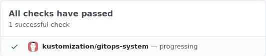

# Setup Notifications

When operating a cluster, different teams may wish to receive notifications about
the status of their GitOps pipelines.
For example, the on-call team would receive alerts about reconciliation
failures in the cluster, while the dev team may wish to be alerted when a new version
of an app was deployed and if the deployment is healthy.

## Prerequisites

To follow this guide you'll need a Kubernetes cluster with the GitOps
toolkit controllers installed on it.
Please see the [get started guide](../get-started/index.md)
or the [installation guide](installation.md).

The GitOps toolkit controllers emit Kubernetes events whenever a resource status changes.
You can use the [notification-controller](../components/notification/controller.md)
to forward these events to Slack, Microsoft Teams, Discord or Rocket chart.
The notification controller is part of the default toolkit installation.

## Define a provider

First create a secret with your Slack incoming webhook:

```sh
kubectl -n flux-system create secret generic slack-url \
--from-literal=address=https://hooks.slack.com/services/YOUR/SLACK/WEBHOOK
```

Note that the secret must contain an `address` field,
it can be a Slack, Microsoft Teams, Discord or Rocket webhook URL.

Create a notification provider for Slack by referencing the above secret:

```yaml
apiVersion: notification.toolkit.fluxcd.io/v1beta1
kind: Provider
metadata:
  name: slack
  namespace: flux-system
spec:
  type: slack
  channel: general
  secretRef:
    name: slack-url
```

The provider type can be `slack`, `msteams`, `discord`, `rocket`, `github`, `gitlab` or `generic`.

When type `generic` is specified, the notification controller will post the incoming
[event](../components/notification/event.md) in JSON format to the webhook address.
This way you can create custom handlers that can store the events in
Elasticsearch, CloudWatch, Stackdriver, etc.

## Define an alert

Create an alert definition for all repositories and kustomizations:

```yaml
apiVersion: notification.toolkit.fluxcd.io/v1beta1
kind: Alert
metadata:
  name: on-call-webapp
  namespace: flux-system
spec:
  providerRef:
    name: slack
  eventSeverity: info
  eventSources:
    - kind: GitRepository
      name: '*'
    - kind: Kustomization
      name: '*'
```

Apply the above files or commit them to the `fleet-infra` repository.

To verify that the alert has been acknowledge by the notification controller do:

```console
$ kubectl -n flux-system get alerts

NAME             READY   STATUS        AGE
on-call-webapp   True    Initialized   1m
```

Multiple alerts can be used to send notifications to different channels or Slack organizations.

The event severity can be set to `info` or `error`.
When the severity is set to `error`, the kustomize controller will alert on any error
encountered during the reconciliation process.
This includes kustomize build and validation errors,
apply errors and health check failures.


When the verbosity is set to `info`, the controller will alert if:

* a Kubernetes object was created, updated or deleted
* heath checks are passing
* a dependency is delaying the execution
* an error occurs


## Git commit status

The `github` and `gitlab` provider are slightly different to the other chat providers. These providers will
link an event back to its source by writing a commit status event to the repository. For more information about how a
commit status works, refer to the [GitHub](https://docs.github.com/en/github/collaborating-with-issues-and-pull-requests/about-status-checks)
or [GitLab](https://docs.gitlab.com/ee/api/commits.html) documentation.

The first image is an example of how it may look like in GitHub while the one below is an example for GitLab.



Currently the provider will only work with Alerts for Kustomization resources as the events have to be linked with a
specific git commit. Any other event that does not contain a commit reference will be ignored by the provider.
Each status will contain some additional information from the event which includes the resource kind, name and reason for the event.
It will be displayed in the format of `{{ .Kind }}/{{ .Name }} - {{ .Reason }}`.

To get started the git provider require an authentication token to communicate with the API.
Follow the [GitHub](https://docs.github.com/en/github/authenticating-to-github/creating-a-personal-access-token)
or [Gitlab](https://docs.gitlab.com/ee/user/profile/personal_access_tokens.html) for a detailed guide how to create a token.
Store the generated token in a Secret with the following data format.
```yaml
apiVersion: v1
kind: Secret
metadata:
  name: github
  namespace: gitops-system
data:
  token: <token>
```

Creating a git provider is very similar to creating other types of providers.
The only caveat being that the provider address needs to point to the same
git repository as the Kustomization resource refers to.
```yaml
apiVersion: notification.toolkit.fluxcd.io/v1beta1
kind: Provider
metadata:
  name: podinfo
  namespace: flux-system
spec:
  type: github
  channel: general
  address: https://github.com/stefanprodan/podinfo
  secretRef:
    name: github
---
apiVersion: notification.toolkit.fluxcd.io/v1beta1
kind: Alert
metadata:
  name: podinfo
  namespace: flux-system
spec:
  providerRef:
    name: podinfo
  eventSeverity: info
  eventSources:
    - kind: Kustomization
      name: podinfo
      namespace: flux-system
```

The secret referenced in the provider is expected to contain a [personal access token](https://docs.github.com/en/github/authenticating-to-github/creating-a-personal-access-token)
to authenticate with the GitHub API.
```yaml
apiVersion: v1
kind: Secret
metadata:
  name: github
  namespace: flux-system
data:
  token: <token>
```
