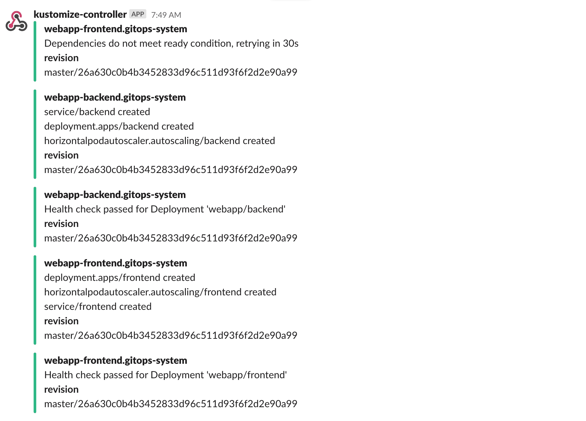
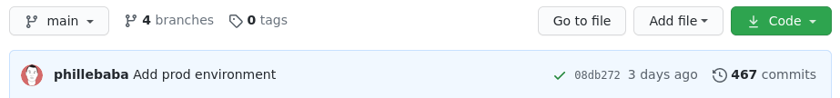
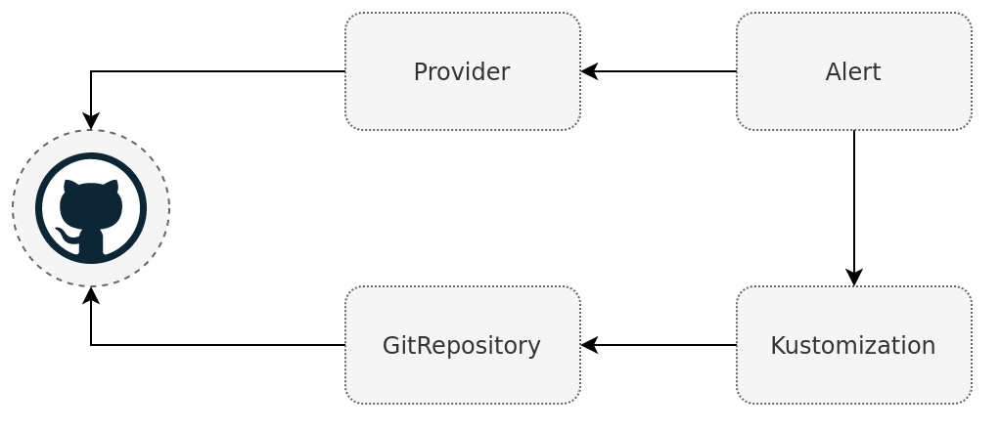
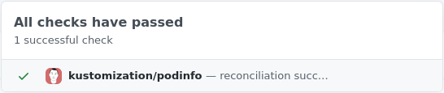
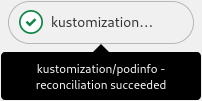
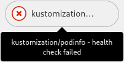

# Setup Notifications

When operating a cluster, different teams may wish to receive notifications about
the status of their GitOps pipelines.
For example, the on-call team would receive alerts about reconciliation
failures in the cluster, while the dev team may wish to be alerted when a new version
of an app was deployed and if the deployment is healthy.

## Prerequisites

To follow this guide you'll need a Kubernetes cluster with the GitOps
toolkit controllers installed on it.
Please see the [get started guide](../get-started/index.md)
or the [installation guide](installation.md).

The GitOps toolkit controllers emit Kubernetes events whenever a resource status changes.
You can use the [notification-controller](../components/notification/controller.md)
to forward these events to Slack, Microsoft Teams, Discord or Rocket chart.
The notification controller is part of the default toolkit installation.

## Define a provider

First create a secret with your Slack incoming webhook:

```sh
kubectl -n flux-system create secret generic slack-url \
--from-literal=address=https://hooks.slack.com/services/YOUR/SLACK/WEBHOOK
```

Note that the secret must contain an `address` field,
it can be a Slack, Microsoft Teams, Discord or Rocket webhook URL.

Create a notification provider for Slack by referencing the above secret:

```yaml
apiVersion: notification.toolkit.fluxcd.io/v1beta1
kind: Provider
metadata:
  name: slack
  namespace: flux-system
spec:
  type: slack
  channel: general
  secretRef:
    name: slack-url
```

The provider type can be `slack`, `msteams`, `discord`, `rocket`, `github`, `gitlab` or `generic`.

When type `generic` is specified, the notification controller will post the incoming
[event](../components/notification/event.md) in JSON format to the webhook address.
This way you can create custom handlers that can store the events in
Elasticsearch, CloudWatch, Stackdriver, etc.

## Define an alert

Create an alert definition for all repositories and kustomizations:

```yaml
apiVersion: notification.toolkit.fluxcd.io/v1beta1
kind: Alert
metadata:
  name: on-call-webapp
  namespace: flux-system
spec:
  providerRef:
    name: slack
  eventSeverity: info
  eventSources:
    - kind: GitRepository
      name: '*'
    - kind: Kustomization
      name: '*'
```

Apply the above files or commit them to the `fleet-infra` repository.

To verify that the alert has been acknowledge by the notification controller do:

```console
$ kubectl -n flux-system get alerts

NAME             READY   STATUS        AGE
on-call-webapp   True    Initialized   1m
```

Multiple alerts can be used to send notifications to different channels or Slack organizations.

The event severity can be set to `info` or `error`.
When the severity is set to `error`, the kustomize controller will alert on any error
encountered during the reconciliation process.
This includes kustomize build and validation errors,
apply errors and health check failures.


When the verbosity is set to `info`, the controller will alert if:

* a Kubernetes object was created, updated or deleted
* heath checks are passing
* a dependency is delaying the execution
* an error occurs



## Git commit status

The GitHub, GitLab, Bitbucket, and Azure DevOps providers are slightly different to the other providers. Instead of
a stateless stream of events, the git notification providers will link the event with accompanying git commit which
triggered the event. The linking is done by updating the commit status of a specific commit.

  - [GitHub](https://docs.github.com/en/github/collaborating-with-issues-and-pull-requests/about-status-checks)
  - [GitLab](https://docs.gitlab.com/ee/api/commits.html)
  - [Bitbucket](https://developer.atlassian.com/server/bitbucket/how-tos/updating-build-status-for-commits/)
  - [Azure DevOps](https://docs.microsoft.com/en-us/rest/api/azure/devops/git/statuses?view=azure-devops-rest-6.0)

In GitHub the commit status set by notification-controller will result in a green checkmark or red cross next to the commit hash.
Clicking the icon will show more detailed information about the status.


Receiving an event in the form of a commit status rather than a message in a chat conversation has the benefit
that it closes the deployment loop giving quick and visible feedback if a commit has reconciled and if it succeeded.
This means that a deployment will work in a similar manner that people are used to with "traditional" push based CD pipelines.
Additionally the status can be fetched from the git providers API for a specific commit. Allowing for custom automation tools
that can automatically promote, commit to a new directory, after receiving a successful commit status. This can all be
done without requiring any access to the Kubernetes cluster.

As stated before the provider works by referencing the same git repository as the Kustomization controller does.
When a new commit is pushed to the repository, source-controller will sync the commit, triggering the kustomize-controller
to reconcile the new commit. After this is done the kustomize-controller sends an event to the notification-controller
with the result and the commit hash it reconciled. Then notification-controller can update the correct commit and repository
when receiving the event.


!!! hint "Limitations"
    The git notification providers require that a commit hash present in the meta data
    of the event. There for the the providers will only work with `Kustomization` as an
    event source, as it is the only resource which includes this data.

First follow the [get started guide](../../get-started) if you do not have a Kubernetes cluster with Flux installed in it.
You will need a authentication token to communicate with the API. The authentication method depends on
the git provider used, refer to the [Provider CRD](../../components/notification/provider/#git-commit-status)
for details about how to get the correct token. The guide will use GitHub, but the other providers will work in a very similar manner.
The token will need to have write access to the repository it is going to update the commit status in.
Store the generated token in a Secret with the following data format in the cluster.
```yaml
apiVersion: v1
kind: Secret
metadata:
  name: github
  namespace: flux-system
data:
  token: <token>
```

When sending notification events the kustomization-controller will include the commit hash related to the event.
Note that the commit hash in the event does not come from the git repository the `Kustomization` resource
comes from but rather the kustomization source ref. This mean that commit status notifications will not work
if the manifests comes from a repository which the API token is not allowed to write to.

Copy the manifest content in the "[kustomize](https://github.com/stefanprodan/podinfo/tree/master/kustomize)" directory
into the directory "staging-cluster/flux-system/podinfo" in your fleet-infra repository. Make sure that you also add the
namespace podinfo.
```yaml
apiVersion: v1
kind: Namespace
metadata:
  name: podinfo
```

Then create a Kustomization to deploy podinfo.
```yaml
apiVersion: kustomize.toolkit.fluxcd.io/v1beta1
kind: Kustomization
metadata:
  name: podinfo
  namespace: flux-system
spec:
  interval: 5m
  targetNamespace: podinfo
  path: ./staging-cluster/podinfo
  prune: true
  sourceRef:
    kind: GitRepository
    name: flux-system
  healthChecks:
    - apiVersion: apps/v1
      kind: Deployment
      name: podinfo
      namespace: podinfo
  timeout: 1m
```

Creating a git provider is very similar to creating other types of providers.
The only caveat being that the provider address needs to point to the same
git repository as the event source originates from.
```yaml
apiVersion: notification.toolkit.fluxcd.io/v1beta1
kind: Provider
metadata:
  name: flux-system
  namespace: flux-system
spec:
  type: github
  address: https://github.com/<username>/fleet-infra
  secretRef:
    name: github
---
apiVersion: notification.toolkit.fluxcd.io/v1beta1
kind: Alert
metadata:
  name: podinfo
  namespace: flux-system
spec:
  providerRef:
    name: flux-system
  eventSeverity: info
  eventSources:
    - kind: Kustomization
      name: podinfo
      namespace: flux-system
```

By now the fleet-infra repository should have a similar directory structure.
```
fleet-infra
└── staging-cluster/
    ├── flux-system/
    │   ├── gotk-components.yaml
    │   ├── gotk-sync.yaml
    │   └── kustomization.yaml
    ├── podinfo/
    │   ├── namespace.yaml
    │   ├── deployment.yaml
    │   ├── hpa.yaml
    │   ├── service.yaml
    │   └── kustomization.yaml
    ├── podinfo-kustomization.yaml
    └── podinfo-notification.yaml
```

If podinfo is deployed and the health checks pass you should get a successful status in
your forked podinfo repository.

If everything is setup correctly there should now be a green check-mark next to the latest commit.
Clicking the check-mark should show a detailed view.

| GitHub  | GitLab |
| ------------- | ------------- |
|  |  |

Generate error

A deployment failure can be forced by setting an invalid image tag in the podinfo deployment.
```yaml
apiVersion: apps/v1
kind: Deployment
metadata:
  name: podinfo
spec:
  minReadySeconds: 3
  revisionHistoryLimit: 5
  progressDeadlineSeconds: 60
  strategy:
    rollingUpdate:
      maxUnavailable: 0
    type: RollingUpdate
  selector:
    matchLabels:
      app: podinfo
  template:
    metadata:
      annotations:
        prometheus.io/scrape: "true"
        prometheus.io/port: "9797"
      labels:
        app: podinfo
    spec:
      containers:
      - name: podinfod
        image: ghcr.io/stefanprodan/podinfo:fake
        imagePullPolicy: IfNotPresent
        ports:
        - name: http
          containerPort: 9898
          protocol: TCP
        - name: http-metrics
          containerPort: 9797
          protocol: TCP
        - name: grpc
          containerPort: 9999
          protocol: TCP
        command:
        - ./podinfo
        - --port=9898
        - --port-metrics=9797
        - --grpc-port=9999
        - --grpc-service-name=podinfo
        - --level=info
        - --random-delay=false
        - --random-error=false
        env:
        - name: PODINFO_UI_COLOR
          value: "#34577c"
        livenessProbe:
          exec:
            command:
            - podcli
            - check
            - http
            - localhost:9898/healthz
          initialDelaySeconds: 5
          timeoutSeconds: 5
        readinessProbe:
          exec:
            command:
            - podcli
            - check
            - http
            - localhost:9898/readyz
          initialDelaySeconds: 5
          timeoutSeconds: 5
        resources:
          limits:
            cpu: 2000m
            memory: 512Mi
          requests:
            cpu: 100m
            memory: 64Mi
```

After the commit has been reconciled it should return a failed commit status.
This is where the health check in the Kustomization comes into play together
with the timeout. The health check is used to asses the health of the Kustomization.
A failed commit status will not be sent until the health check timeout. Setting
a lower timeout will give feedback faster, but may sometimes not allow enough time
for a new application to deploy.

| GitHub  | GitLab |
| ------------- | ------------- |
|  |  |


### Status changes

The provider will continuously receive events as they happen, and multiple events may
be received for the same commit hash. The git providers are configured to only update
the status if the status has changed. This is to avoid spamming the commit status
history with the same status over and over again.

There is an aspect of state fullness that needs to be considered, compared to the other
notification providers, as the events are stored by the git provider. This means that
the status of a commit can change over time. Initially a deployment may be healthy, resulting
in a successful status. Down the line the application, and the health check, may start failing
due to the amount of traffic it receives or external dependencies no longer being available.
The change in the health check would cause the status to go from successful to failed.
It is important to keep this in mind when building any automation tools that deals with the
status, and consider the fact that receiving a successful status once does not mean it will
always be successful.

