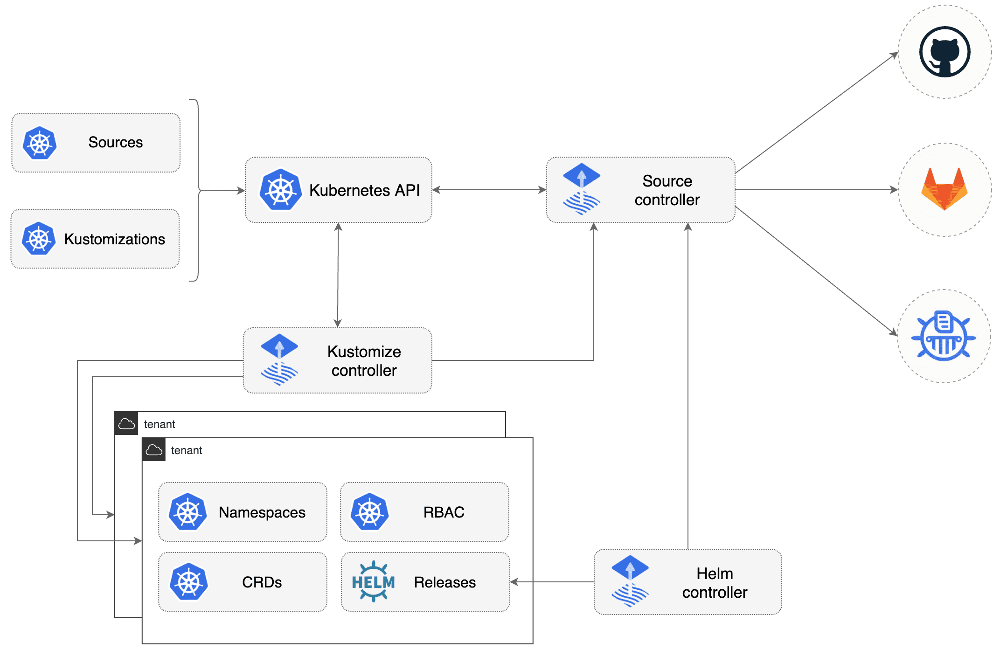

# GitOps Toolkit

The GitOps Toolkit is a set of composable APIs and specialized tools
that can be used to build a Continuous Delivery platform on top of Kubernetes.

These tools are built with Kubernetes controller-runtime libraries and they
can be dynamically configured with Kubernetes custom resources either by
cluster admins or by other automated tools.
The GitOps Toolkit components interact with each other via Kubernetes
events and are responsible for the reconciliation of their designated API objects. 

!!! hint "Work in Progress"
    We envision a future where **Flux v2** and **Helm Operator v2** will be assembled from
    the GitOps Toolkit components. The Flux CD team is looking for feedback and help as 
    the toolkit is in an active experimentation phase.
    If you wish to take part in this quest please reach out to us on Slack and GitHub.

Target features:

- Source management
- Kustomize and Helm support 
- Event-based and on-a-schedule reconciliation
- Role-based reconciliation (multi-tenancy)
- Health assessment (clusters and workloads)
- Dependency management (infra and workloads)
- Alerting to external systems (webhook senders)
- External events handling (webhook receivers)
- Source write-back (automated patching)
- Policy driven validation (OPA, admission controllers)
- Seamless integration with Git providers (GitHub, GitLab, Bitbucket)
- Interoperability with workflow providers (GitHub Actions, Tekton, Argo)
- Interoperability with CAPI providers

Components:

- [Toolkit CLI](https://github.com/fluxcd/toolkit)
- [Source Controller](components/source/controller.md)
    - [GitRepository CRD](components/source/gitrepositories.md)
    - [HelmRepository CRD](components/source/helmrepositories.md)
    - [HelmChart CRD](components/source/helmcharts.md)
- [Kustomize Controller](components/kustomize/controller.md)
    - [Kustomization CRD](components/kustomize/kustomization.md)
- [Helm Controller](components/helm/controller.md)
    - [HelmRelease CRD](components/helm/helmreleases.md)
- [Notification Controller](components/notification/controller.md)
    - [Provider CRD](components/notification/provider.md)
    - [Alert CRD](components/notification/alert.md)
    - [Receiver CRD](components/notification/receiver.md)

To get started with the toolkit please follow this [guide](get-started/index.md).
