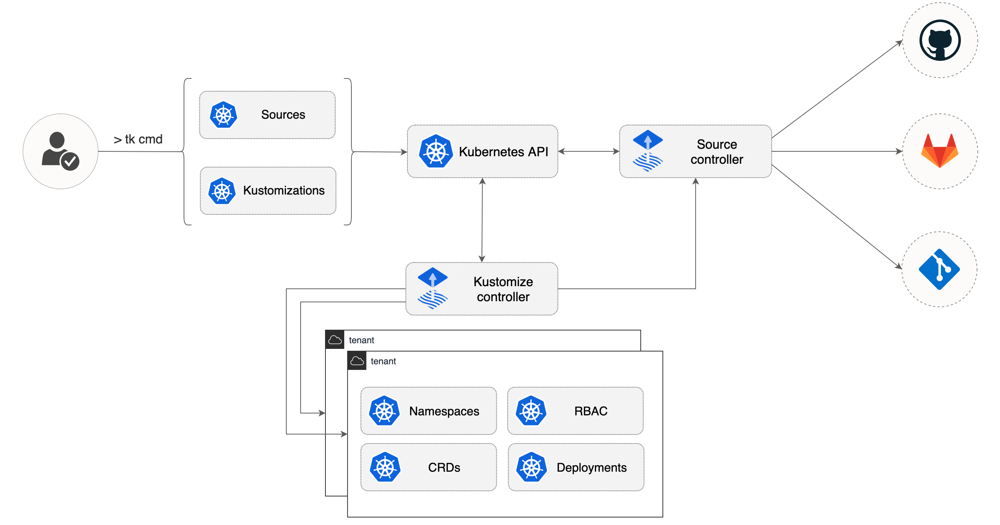

# GitOps Toolkit

The GitOps Toolkit is a set of composable APIs and specialized tools
that can be used to build a Continuous Delivery platform on top of Kubernetes.

These tools are built with Kubernetes controller-runtime libraries and they
can be dynamically configured with Kubernetes custom resources either by
cluster admins or by other automated tools.
The GitOps Toolkit components interact with each other via Kubernetes
events and are responsible for the reconciliation of their designated API objects. 

Components:

- [Toolkit CLI](https://github.com/fluxcd/toolkit)
- [Source Controller](https://github.com/fluxcd/source-controller)
- [Kustomize Controller](https://github.com/fluxcd/kustomize-controller)

To get started with the toolkit please follow this [guide](get-started/index.md).
