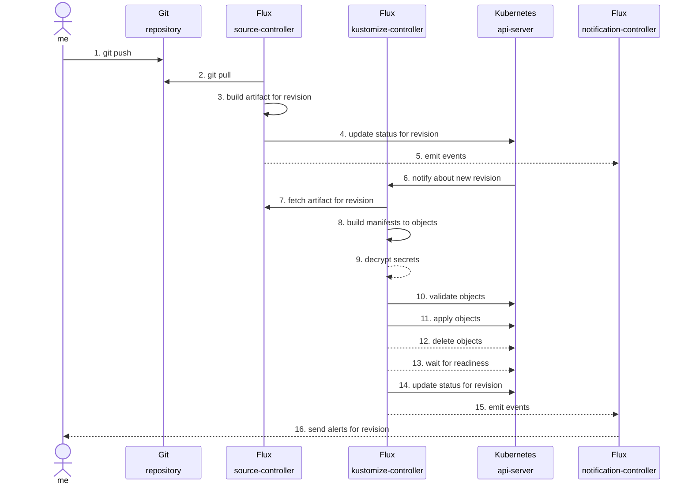
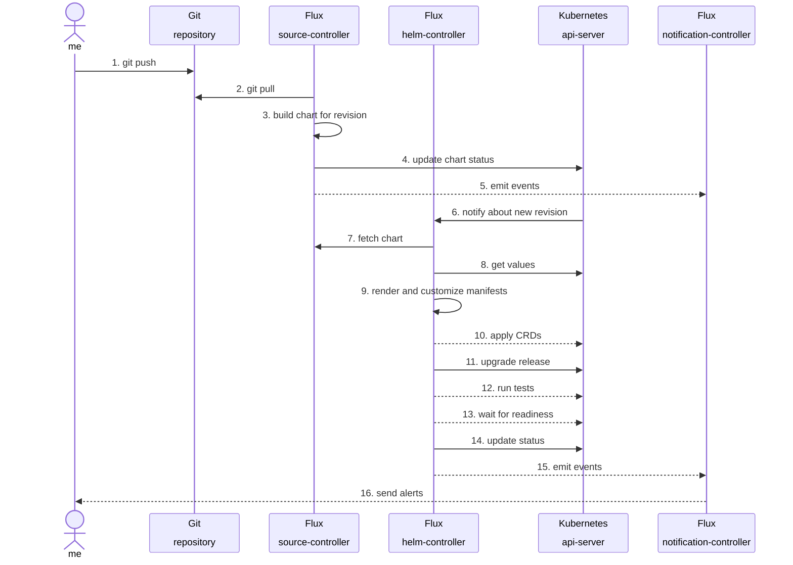
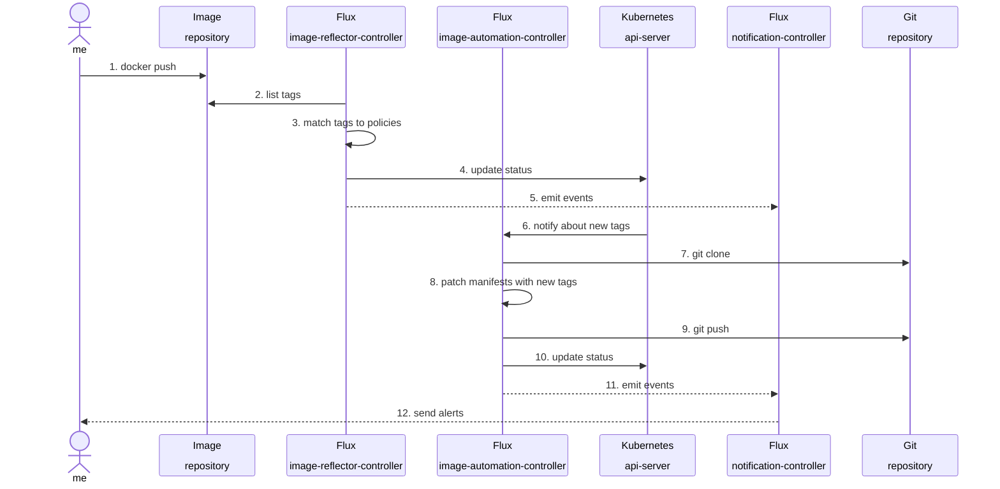

# Flux Diagrams

## Cluster sync from Git

```mermaid
sequenceDiagram
    actor me
    participant git as Git<br><br>repository
    participant sc as Flux<br><br>source-controller
    participant kc as Flux<br><br>kustomize-controller
    participant kube as Kubernetes<br><br>api-server
    participant nc as Flux<br><br>notification-controller
    me->>git: 1. git push
    sc->>git: 2. git pull
    sc->>sc: 3. build artifact for revision
    sc->>kube: 4. update status for revision
    sc-->>nc: 5. emit events
    kube->>kc: 6. notify about new revision
    kc->>sc: 7. fetch artifact for revision
    kc->>kc: 8. build manifests to objects
    kc-->>kc: 9. decrypt secrets
    kc->>kube: 10. validate objects
    kc->>kube: 11. apply objects
    kc-->>kube: 12. delete objects
    kc-->>kube: 13. wait for readiness
    kc->>kube: 14. update status for revision
    kc-->>nc: 15. emit events
    nc-->>me: 16. send alerts for revision
```

## Helm release upgrade from Git

```mermaid
sequenceDiagram
    actor me
    participant git as Git<br><br>repository
    participant sc as Flux<br><br>source-controller
    participant hc as Flux<br><br>helm-controller
    participant kube as Kubernetes<br><br>api-server
    participant nc as Flux<br><br>notification-controller
    me->>git: 1. git push
    sc->>git: 2. git pull
    sc->>sc: 3. build chart for revision
    sc->>kube: 4. update chart status
    sc-->>nc: 5. emit events
    kube->>hc: 6. notify about new revision
    hc->>sc: 7. fetch chart
    hc->>kube: 8. get values
    hc->>hc: 9. render and customize manifests
    hc-->>kube: 10. apply CRDs
    hc->>kube: 11. upgrade release
    hc-->>kube: 12. run tests
    hc-->>kube: 13. wait for readiness
    hc->>kube: 14. update status
    hc-->>nc: 15. emit events
    nc-->>me: 16. send alerts
```

## Image update to Git

```mermaid
sequenceDiagram
    actor me
    participant oci as Image<br><br>repository
    participant irc as Flux<br><br>image-reflector-controller
    participant iac as Flux<br><br>image-automation-controller
    participant kube as Kubernetes<br><br>api-server
    participant nc as Flux<br><br>notification-controller
    participant git as Git<br><br>repository
    me->>oci: 1. docker push
    irc->>oci: 2. list tags
    irc->>irc: 3. match tags to policies
    irc->>kube: 4. update status
    irc-->>nc: 5. emit events
    kube->>iac: 6. notify about new tags
    iac->>git: 7. git clone
    iac->>iac: 8. patch manifests with new tags
    iac->>git: 9. git push
    iac->>kube: 10. update status
    iac-->>nc: 11. emit events
    nc-->>me: 12. send alerts
```

