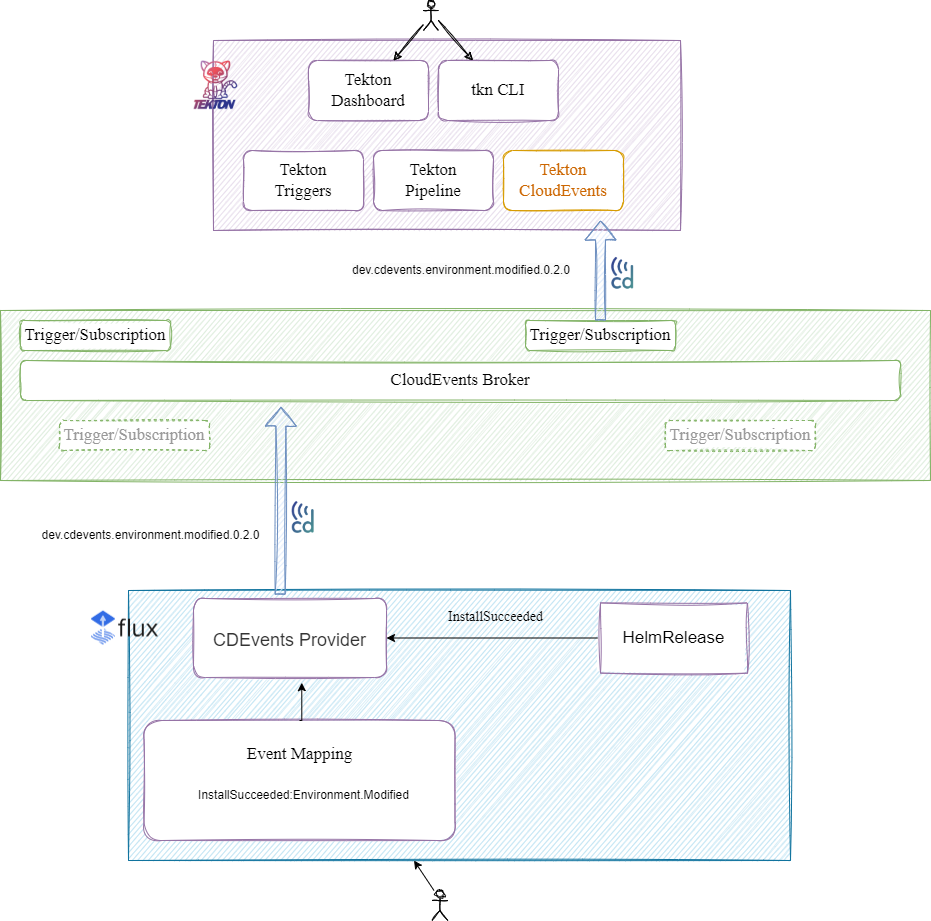

# Flux CDEvents Provider

<!--
The title must be short and descriptive.
-->

**Status:** provisional

<!--
Status represents the current state of the RFC.
Must be one of `provisional`, `implementable`, `implemented`, `deferred`, `rejected`, `withdrawn`, or `replaced`.
-->

**Creation date:** 2024-01-19

**Last update:** 2024-06-05

## Summary

This RFC proposes to add a `Provider` type to the Flux notification-controller API for sending
[CDEvents](https://github.com/cdevents).

When `Provider` objects configured to send CDEvents are alerted by a Flux event, they will utilise an already defined
mapping of Flux and CDEvents events to send an appropriate CDEvent payload to a defined URL.
<!--
One paragraph explanation of the proposed feature or enhancement.
-->

## Motivation

CDEvents enables interoperability between supporte   tools in a workflow, and flux is a very popular continuous delivery
tool, as such we have received many questions about implementing CDEvents into the tool. The receiver part of this
integration is already implemented in flux 2.3.0
<!--
This section is for explicitly listing the motivation, goals, and non-goals of
this RFC. Describe why the change is important and the benefits to users.
-->

### Goals

Integrate [CDEvents](https://github.com/cdevents) into Flux with a CDEvents Provider that supports sending CDEvent
events.

<!--
List the specific goals of this RFC. What is it trying to achieve? How will we
know that this has succeeded?
-->

### Non-Goals

Implementing CDEvents into every Flux controller that is not the notification controller. 

<!--
What is out of scope for this RFC? Listing non-goals helps to focus discussion
and make progress.
-->

## Proposal

Add CDEvents to the list of available `Providers` in Flux Notification controller. The relevant CDEvent sent by the
`Provider` will be determined by a pre-defined mapping of Flux events and relevant CDEvents. These CDEvent payloads
should have meaningful data from the source event. There will be an initial focus on HelmRelease and related events as
the format within Flux for those events is much more consistent.
<!--
This is where we get down to the specifics of what the proposal actually is.
This should have enough detail that reviewers can understand exactly what
you're proposing, but should not include things like API designs or
implementation.

If the RFC goal is to document best practices,
then this section can be replaced with the actual documentation.
-->

### User Stories

Users of multiple CI/CD tools such as Tekton and Flux could use CDEvents as a way to enable interoperability.

For example, a user may want a Tekton `pipeline` to run once a HelmRelease flux resource has succeeded in a Helm
install. On successful helm install, Flux will emit an event with reason `InstallSucceeded` which will be mapped to an
`Environment.Modified` CDEvent. The CDEvent `Provider` will then send a payload with that CDEvent, which will also
contain data from the Flux event, to a CloudEvents broker that Tekton is subscribed to, and trigger a Pipeline Run
within Tekton. 




<!--
Optional if existing discussions and/or issues are linked in the motivation section.
-->

### Alternatives

There are currently no viable alternatives for the CDEvent Provider.
<!--
List plausible alternatives to the proposal and explain why the proposal is superior.

This is a good place to incorporate suggestions made during discussion of the RFC.
-->

## Design Details

Adding a Flux `Provider` for CDEvents that will send a CDEvent payload upon receiving a flux event from an alert. 

Once an alert is triggered for this provider, it will send a CDEvent that corresponds to the Flux event that caused the
alert. This CDEvent will be created using the [CDEvents Go SDK](https://github.com/cdevents/sdk-go). The implementation
will include a defined mapping of which Flux events trigger a corresponding CDEvent.

The CDEvents broker is not a part of this design and is left to the users to set up however they wish.

Example Provider YAML:

```yaml
apiVersion: notification.toolkit.fluxcd.io/v1beta2
kind: Provider
metadata:
  name: cdevents-provider
  namespace: flux-system
spec:
  type: cdevents
  secretRef:
    name: generic-token
  address: http://10.100.0.17:5000
```

Example Default Mappings (Please note these are not final and will be open to discussion):

| Helm Event                | CDEvent                         |
| ------------------------- | ------------------------------- |
| InstallSucceeded          | Environment.Modified            |
| InstallFailed             | Incident.Detected               |
|UpgradeSucceeded           | TaskRun.Finished (with outcome success)                |
|UpgradeFailed              | TaskRun.Finished (with outcome failed)              |
|TestSucceeded              | TestCaseRun.finished (outcome pass)           | 
|TestFailed                 | TestCaseRun.finished (outcome fail)              | 
|RollbackSucceeded          | TaskRun.Finished (with outcome success)           |
|RollbackFailed             | TaskRun.Finished (with outcome failed)           |
|UninstallSucceeded         | Environment.Modified            |
|UninstallFailed            | Incident.Detected               |
|ReconciliationSucceeded    | Environment.Modified            | 
|ReconciliationFailed       | Incident.Detected               | 

<!--
This section should contain enough information that the specifics of your
change are understandable. This may include API specs and code snippets.

The design details should address at least the following questions:
- How can this feature be enabled / disabled?
- Does enabling the feature change any default behavior?
- Can the feature be disabled once it has been enabled?
- How can an operator determine if the feature is in use?
- Are there any drawbacks when enabling this feature?
-->

## Implementation History

<!--
Major milestones in the lifecycle of the RFC such as:
- The first Flux release where an initial version of the RFC was available.
- The version of Flux where the RFC graduated to general availability.
- The version of Flux where the RFC was retired or superseded.
-->
